# Audience Builder - Production Architecture

## 전체 시스템 아키텍처 (System Architecture Overview)

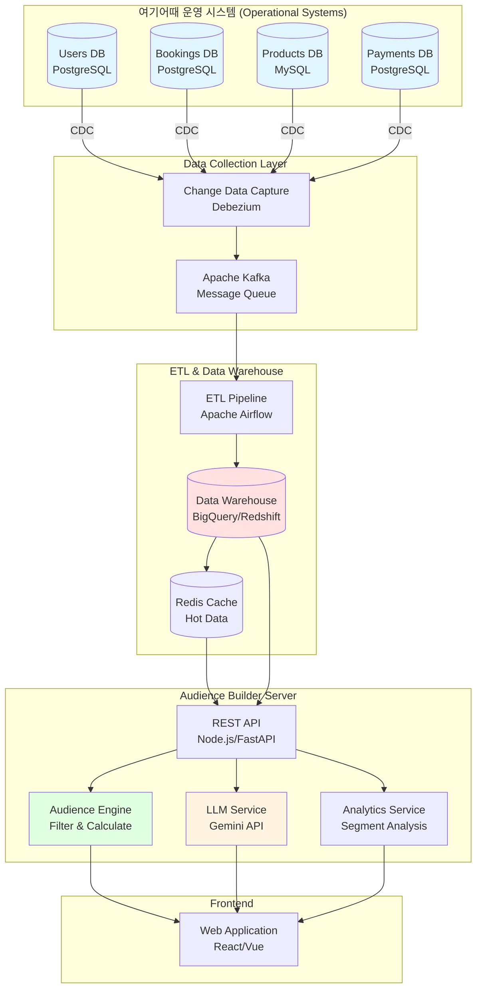

## 1. 데이터 수집 및 동기화 플로우 (Data Collection & Sync Flow)

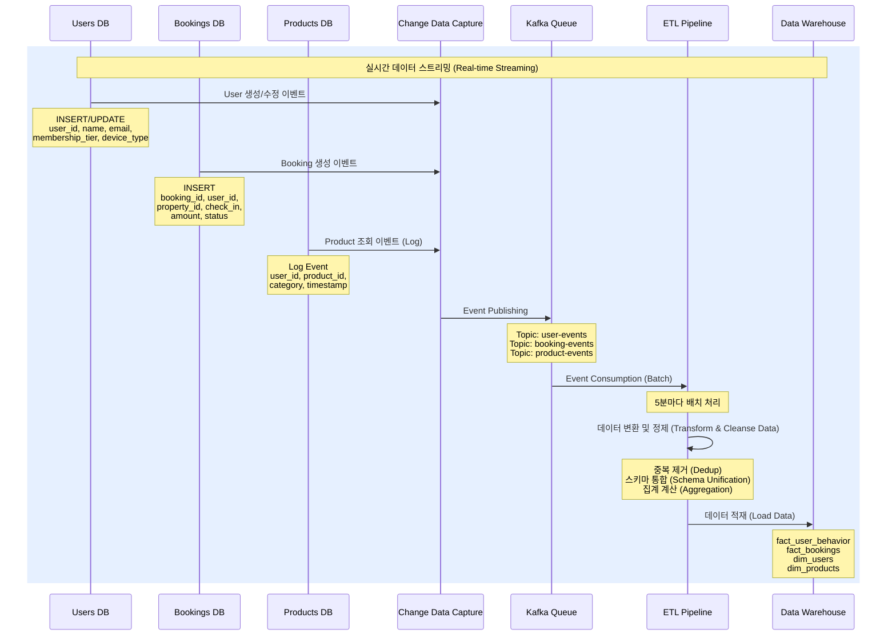

## 2. Audience Builder Server 초기화 플로우 (Server Initialization)

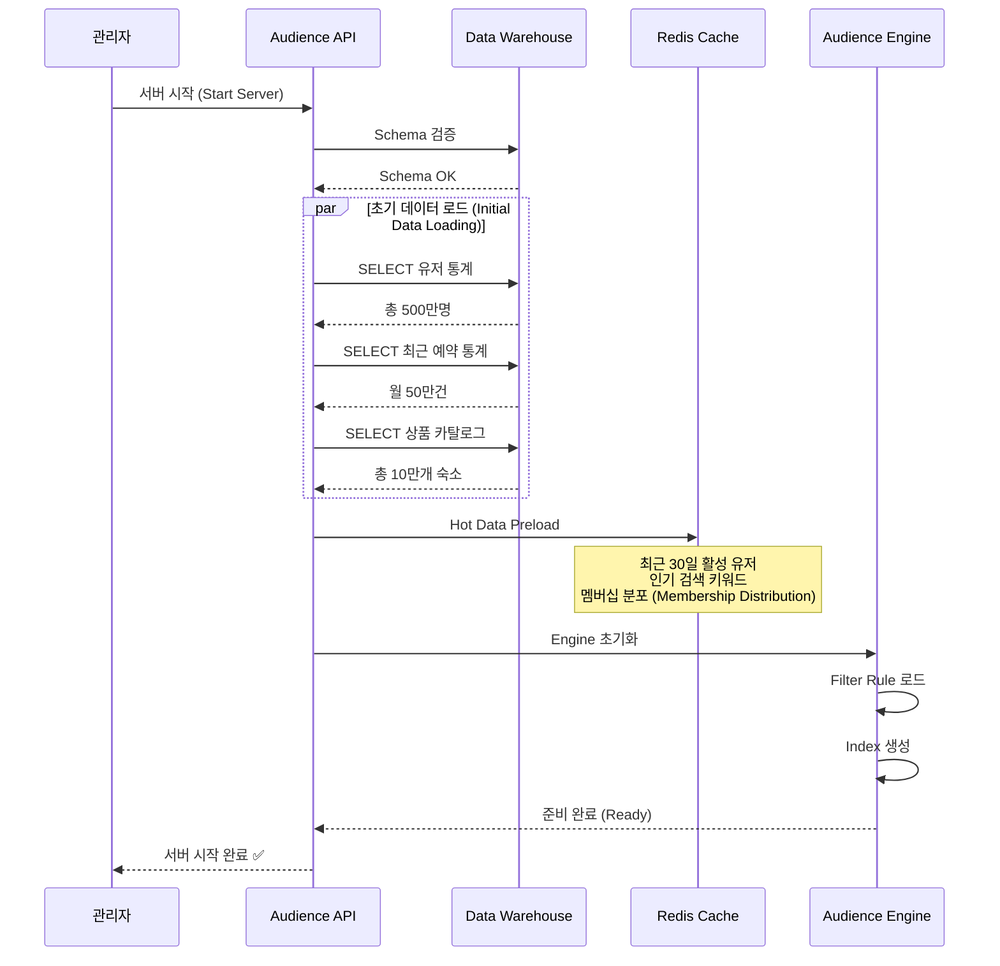

## 3. 실시간 Audience 조회 플로우 (Real-time Query Flow - Rule-Based)

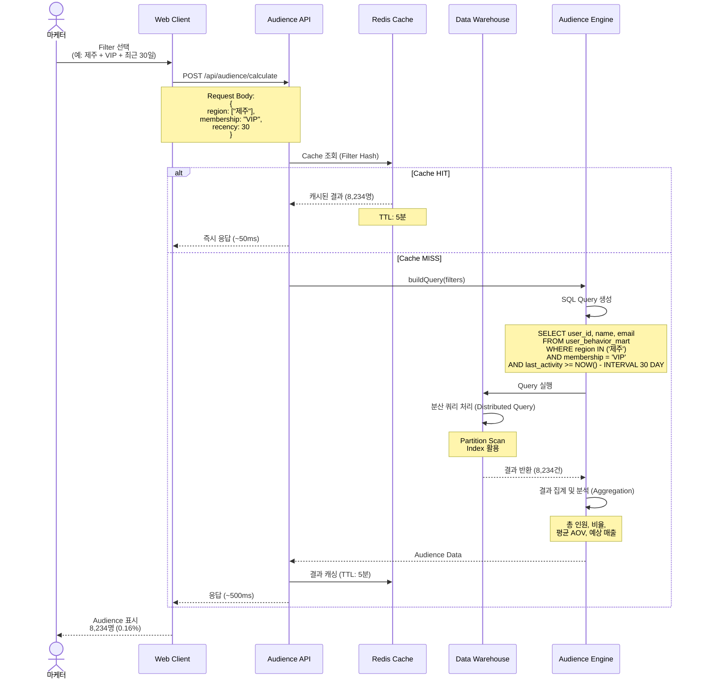

## 4. LLM 기반 자연어 쿼리 플로우 (LLM-based Natural Language Query)

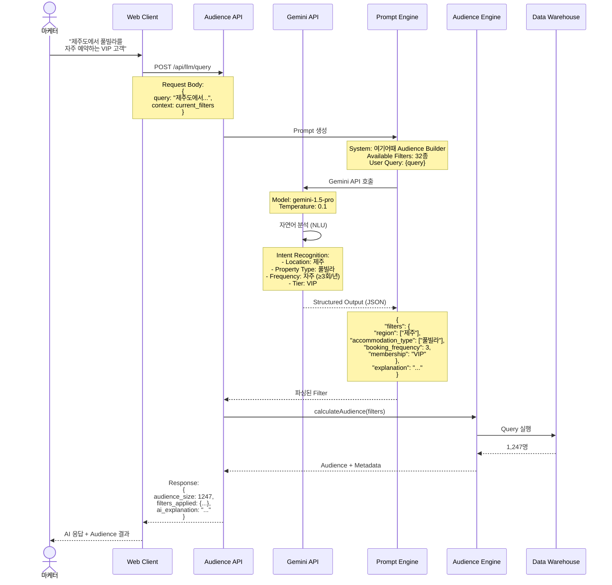

## 5. Audience 내보내기 및 Marketing Platform 연동

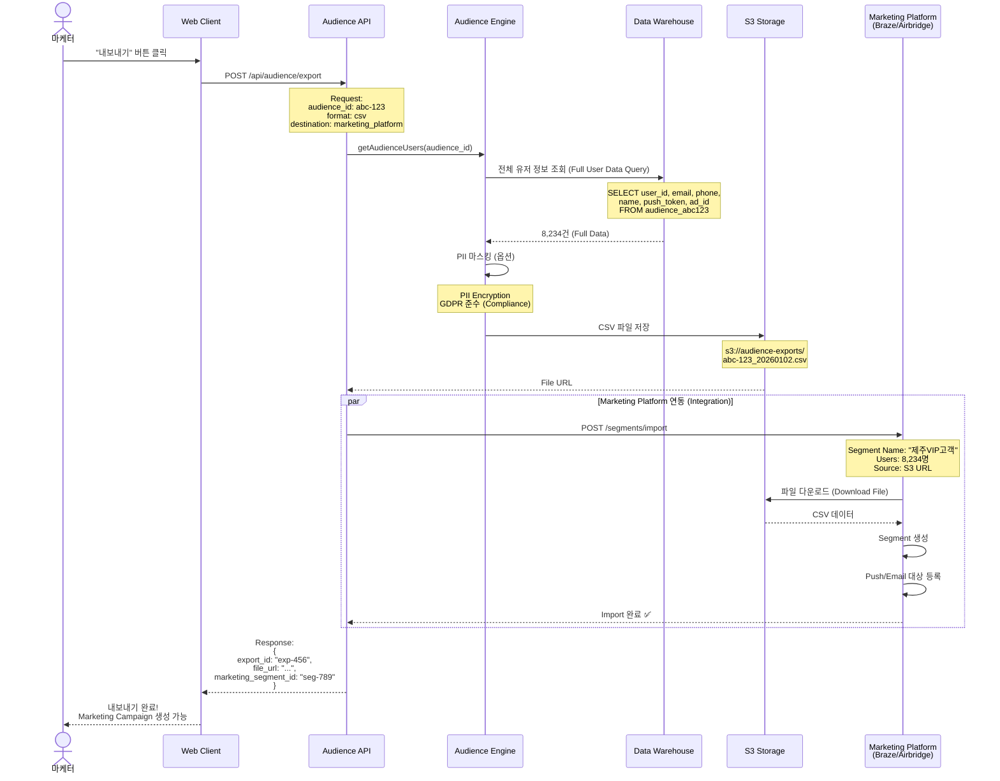

## 6. 실시간 데이터 업데이트 (WebSocket Real-time Updates)

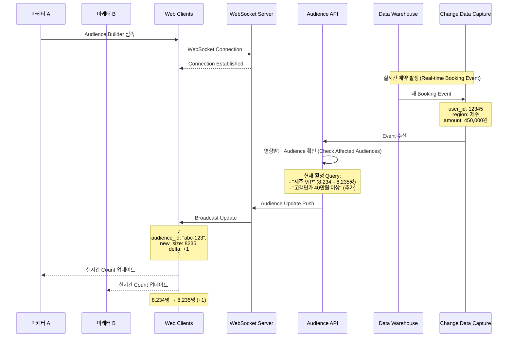

## 7. Data Mart 구조 (Data Warehouse Schema)

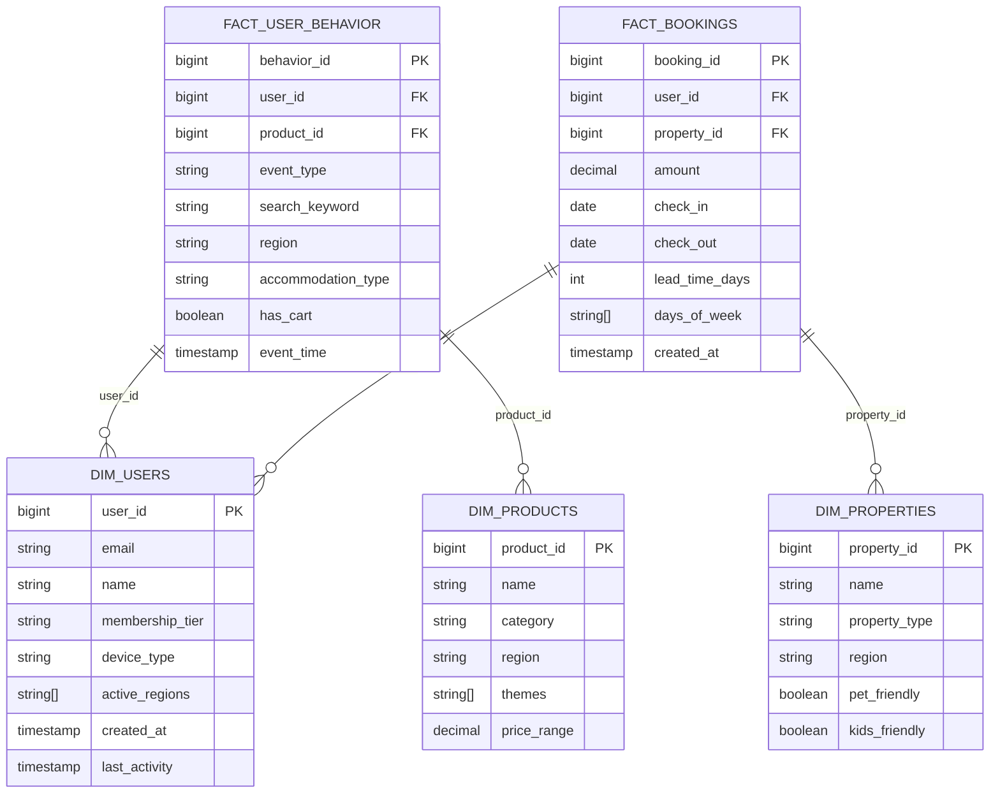

## 8. 성능 최적화 아키텍처 (Performance Optimization Architecture)

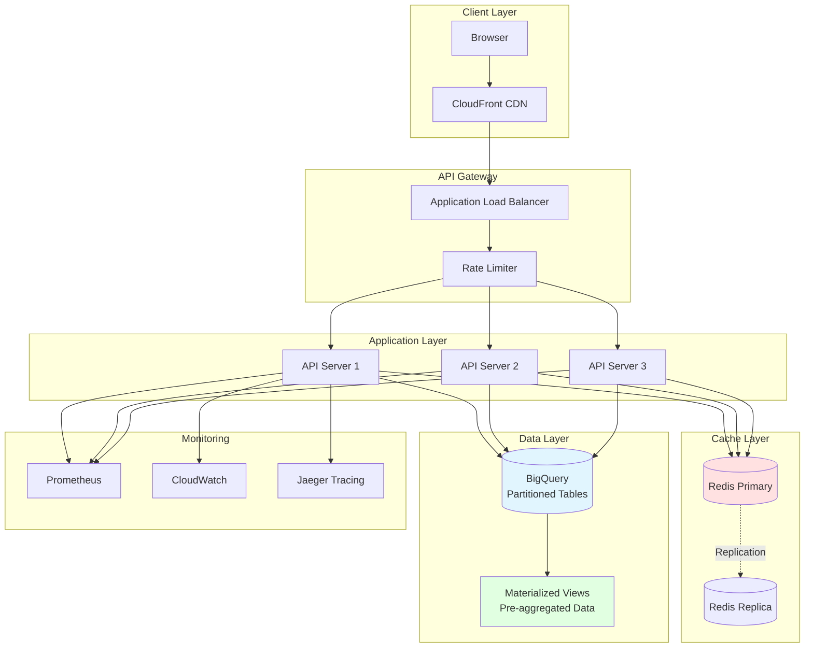

## 주요 성능 지표 (Performance Metrics)

| Layer | Component | 평균 응답 시간 (Avg Latency) | 처리량 (Throughput/TPS) | SLA |
|-------|-----------|------------------------------|-------------------------|-----|
| CDN | CloudFront | 10-50ms | 10,000+ | 99.99% |
| API Gateway | Load Balancer | 5ms | 5,000 | 99.95% |
| Cache | Redis | 1-5ms | 100,000+ | 99.9% |
| Query | BigQuery (Cache HIT) | 50ms | 1,000 | 99.5% |
| Query | BigQuery (Cache MISS) | 500-2000ms | 200 | 99% |
| LLM | Gemini API | 1000-3000ms | 50 | 99% |

## Data Pipeline 처리 흐름 (Data Processing Pipeline)

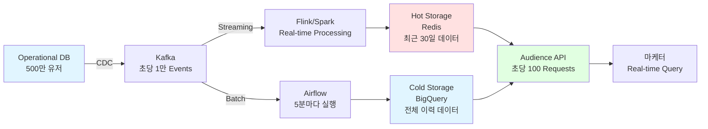

## 데이터 보안 및 Governance (Security & Data Governance)

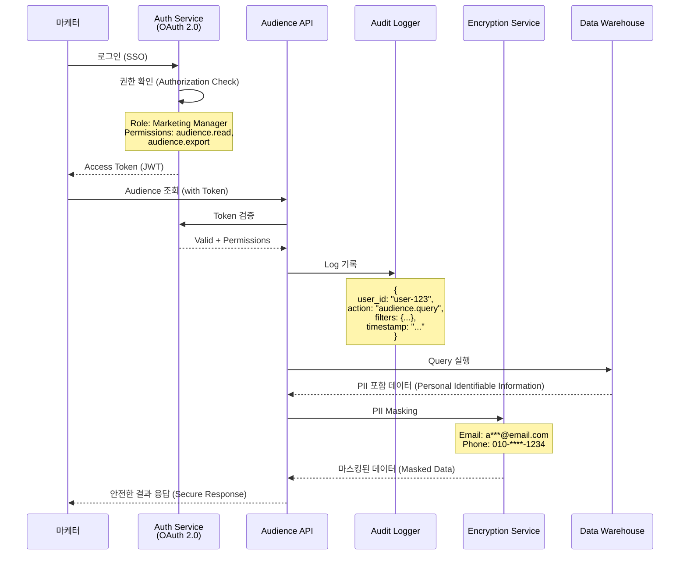

---

## 전체 시스템 용량 및 확장성 (System Capacity & Scalability)

### 📊 시스템 규모 (System Scale)
- **총 유저 (Total Users)**: 500만명
- **일일 예약 (Daily Bookings)**: 50만건
- **실시간 이벤트 (Real-time Events)**: 초당 1만건
- **Audience 쿼리 (Query Rate)**: 초당 100회
- **동시 접속 마케터 (Concurrent Users)**: 200명

### 🗄️ 데이터 관리 (Data Management)
- **데이터 보관 기간 (Retention)**: 3년 (Partitioned Tables)
- **Backup**: 일 1회 (Daily Snapshot)
- **Disaster Recovery**: Multi-Region (서울 Primary, 도쿄 DR)

### ⚙️ Auto Scaling 정책 (Scaling Policy)
- **Application Server**: CPU 70% 기준 Scale Out
- **Redis Cache**: Memory 80% 기준 Replica 추가
- **BigQuery**: Concurrent Query 기준 Slot 자동 조정

### 🔐 보안 및 Compliance
- **Encryption**: AES-256 (Data at Rest), TLS 1.3 (Data in Transit)
- **PII Protection**: Field-level Encryption, Dynamic Masking
- **Compliance**: GDPR, CCPA, 개인정보보호법 준수
- **Access Control**: RBAC (Role-Based Access Control)
- **Audit Trail**: 모든 Query 및 Export 이력 기록
