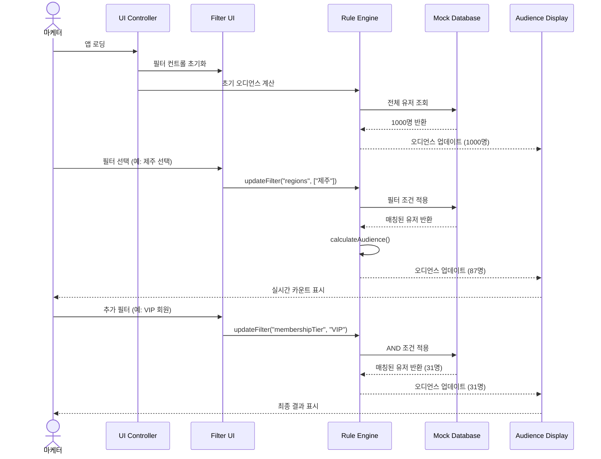
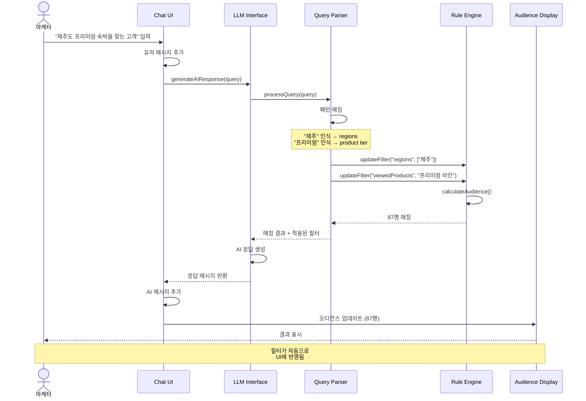
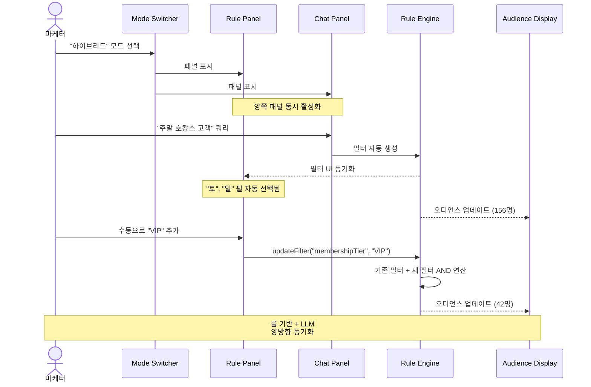
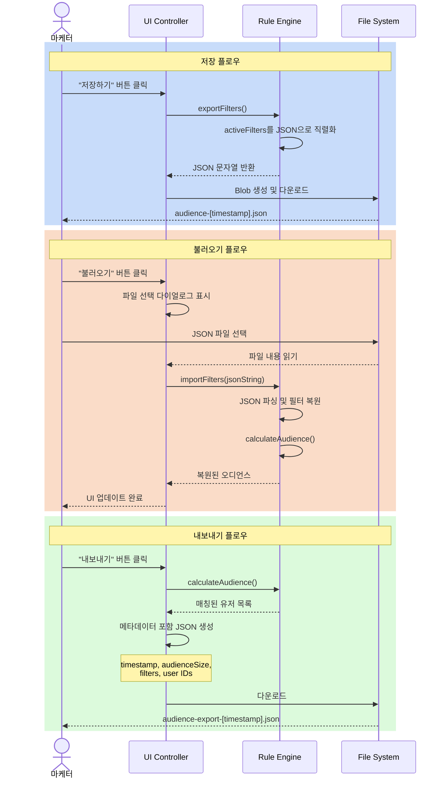
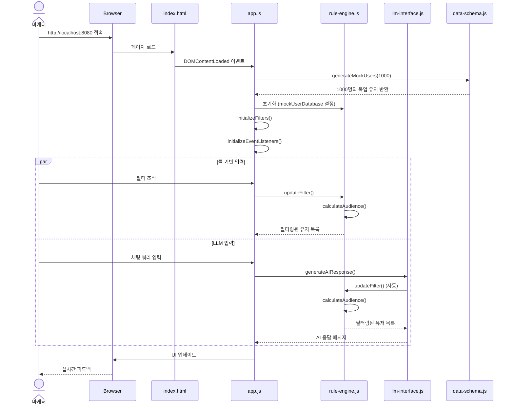
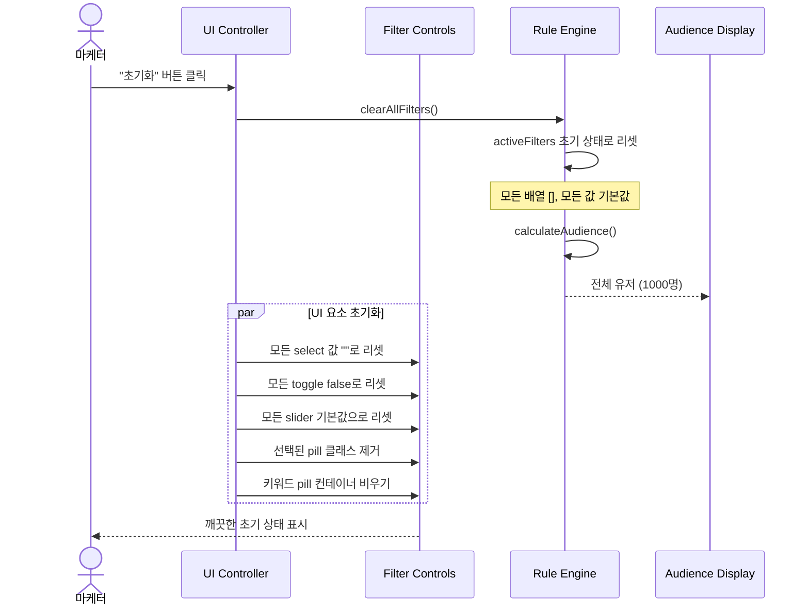
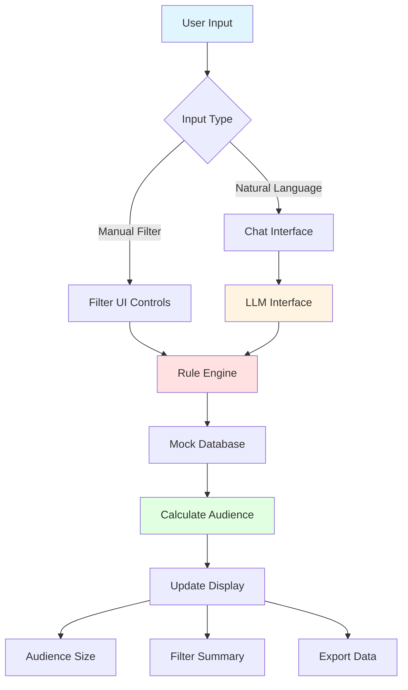

# 오디언스 빌더 - 시퀀스 다이어그램

## 1. 룰 기반 필터링 플로우

## 2. LLM 자연어 쿼리 플로우

## 3. 하이브리드 모드 플로우

## 4. 오디언스 저장/내보내기 플로우

## 5. 전체 시스템 아키텍처 플로우

## 6. 필터 초기화 플로우

## 핵심 컴포넌트 간 관계

## 주요 데이터 흐름

| 단계 | 컴포넌트 | 입력 | 출력 | 처리 시간 |
|------|----------|------|------|-----------|
| 1 | UI Event | 유저 액션 | Filter 변경 이벤트 | ~0ms |
| 2 | Rule Engine | Filter 조건 | AND 연산 적용 | ~5ms |
| 3 | Mock DB | 1000 유저 순회 | 필터링된 배열 | ~10ms |
| 4 | Calculate | 필터링된 배열 | 카운트 + 메타데이터 | ~2ms |
| 5 | UI Update | 오디언스 데이터 | DOM 렌더링 | ~5ms |
| **합계** | - | - | - | **~22ms** |

모든 필터링이 **실시간(< 25ms)**으로 처리됩니다! ⚡
