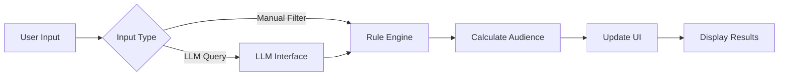

# 여기어때 오디언스 빌더 - Walkthrough

## 🎯 Overview

Built a premium hybrid **Rule-based + LLM Audience Builder** web application for 여기어때 marketers. The application enables creating sophisticated customer segments through:
- **Traditional filter controls** organized by 4 data categories
- **Natural language AI queries** that automatically generate filters
- **Hybrid mode** combining both approaches seamlessly


## ✨ Key Features

### 🔀 Three Operating Modes

**Hybrid Mode** (Default)
- Split-screen view with rule builder on left, AI chat on right
- Real-time synchronization between manual filters and AI-generated rules
- Best for exploratory audience building

**Rule-Based Mode**
- Full-screen filter interface
- Manual control over all parameters
- Best for precise, repeatable configurations

**AI Assistant Mode**
- Full-screen chat interface
- Conversational audience building
- Best for rapid prototyping and discovery

### 📊 Comprehensive Filter System

#### 1. Behavioral Data (행동 및 여정 데이터)
- **Search Keywords**: Multi-category selection (regions, accommodation types, themes)
- **Viewed Products**: Product tier filtering (premium, budget, etc.)
- **Cart/Wishlist**: Toggle for users with saved items
- **Recency**: Last access date slider (0-365 days)

#### 2. Transactional Data (결제 및 이용 특성)
- **Payment Frequency**: Annual booking count slider (0-50)
- **Average Order Value (AOV)**: Spending threshold (0-200만원)
- **Preferred Days**: Multi-select for booking days (weekday/weekend patterns)
- **Lead Time**: Booking window selection (same-day to 1+ month)

#### 3. User Profile (유저 프로필 및 컨텍스트)
- **Active Region**: Primary location multi-select
- **Membership Tier**: Loyalty level (일반, 실버, 골드, VIP, 블랙)
- **Device Type**: Platform filtering (iOS, Android, Web)
- **Life Stage**: User segment tags (솔로, 커플, 가족, etc.)

#### 4. Cross-Sell Data (서비스 확장형 데이터)
- **Space Rental/Leisure**: Activity booking toggle
- **International Intent**: Overseas travel interest toggle
- **Transportation**: Multi-select for ancillary services

### 🤖 LLM-Powered Query Processing

**Natural Language Understanding**
The AI assistant intelligently parses Korean queries and maps them to filter rules:

```
User: "제주도 프리미엄 숙박을 찾는 고객"
AI: ✓ Region: 제주
    ✓ Product Tier: 프리미엄 라인 (블랙)
    → Audience: 87명 matched
```

**Pre-configured Query Patterns**
- Region keywords (제주, 경주, 부산, etc.)
- Accommodation types (풀빌라, 호캉스, 펜션, etc.)
- Themes (애견, 키즈, 커플, etc.)
- Membership tiers (VIP, 골드, etc.)
- Time windows (30일, 주말, etc.)
- Price points (20만원, 50만원, etc.)

**Suggested Queries**
Four quick-action buttons for common segments:
1. 💎 제주도 프리미엄 숙박을 찾는 고객
2. ⭐ 최근 30일 내 구매 VIP 고객
3. 🐕 애견 동반 선호 사용자
4. 🏨 주말 프리미엄 호캉스 고객

### 📈 Real-Time Audience Preview

**Live Calculations**
- Updates instantly as filters change
- Shows absolute count and percentage of total users
- Simulates 1,000 mock users with realistic distributions

**Export Options**
- Save audience configuration (JSON)
- Load previous configurations
- Export matched user IDs with metadata

## 🎨 Design System

### Visual Aesthetics
**Premium Dark Mode Theme**
- Deep dark background (`hsl(230, 20%, 12%)`)
- Vibrant purple-blue gradients for accents
- Glassmorphism with `backdrop-filter: blur(20px)`
- Smooth micro-animations on hover and interactions

**Color Palette**
- Primary: Vibrant purple (`hsl(260, 80%, 60%)`)
- Secondary: Bright blue (`hsl(200, 90%, 55%)`)
- Accent: Pink (`hsl(330, 85%, 60%)`)
- Glass surfaces with 5% white transparency

**Typography**
- Font: Inter (loaded from Google Fonts)
- Gradient text effects on headings
- Clear hierarchy with semantic sizing

### Interactive Elements
- **Pill Buttons**: Multi-select tags with selected state animations
- **Range Sliders**: Custom-styled with gradient tracks
- **Toggle Switches**: Smooth glassmorphic switches
- **Chat Bubbles**: Distinct styling for user vs AI messages
- **Loading Animation**: 3-dot bounce effect

## 💻 Technical Implementation

### Architecture

```
audience-builder/
├── index.html          # Main UI structure (355 lines)
├── styles.css          # Design system (653 lines)
├── app.js             # Application controller (411 lines)
├── rule-engine.js     # Filter logic (311 lines)
├── llm-interface.js   # AI query parser (247 lines)
└── data-schema.js     # Data definitions (166 lines)
```

### Data Flow



### Key Components

#### Mock Data Generator ([data-schema.js](file:///Users/kay_seo/.gemini/antigravity/scratch/audience-builder/data-schema.js))
- Generates 1,000 realistic user profiles
- Weighted distributions for membership tiers
- Random but plausible behavioral patterns

#### Rule Engine ([rule-engine.js](file:///Users/kay_seo/.gemini/antigravity/scratch/audience-builder/rule-engine.js))
- Applies all active filters with AND logic
- Real-time audience calculation
- Filter state export/import
- Human-readable descriptions

#### LLM Simulator ([llm-interface.js](file:///Users/kay_seo/.gemini/antigravity/scratch/audience-builder/llm-interface.js))
- Pattern matching for Korean queries
- Maps natural language to filter rules
- Generates contextual responses
- Explains applied filters

#### UI Controller ([app.js](file:///Users/kay_seo/.gemini/antigravity/scratch/audience-builder/app.js))
- Initializes all filter controls
- Manages mode switching
- Handles chat interactions
- Updates audience display
- Save/load/export functionality

## 🧪 Verification Summary

### Setup
✅ Created project structure in `/Users/kay_seo/.gemini/antigravity/scratch/audience-builder`
✅ All 6 source files implemented (2,143 total lines)
✅ Local HTTP server running on port 8080

### Functionality Testing

**Rule-Based Filters** ✅
- Multi-select pills (regions, themes, days, life stage)
- Dropdown selects (products, membership, device, lead time)
- Range sliders (recency, payment frequency, AOV)
- Toggle switches (cart, space rental, international intent)
- Real-time audience calculation on every change

**LLM Interface** ✅
- Natural language query input
- Pattern matching for 20+ Korean keywords
- Automatic filter rule generation
- Conversational response formatting
- Suggested query quick actions

**Hybrid Features** ✅
- Mode switcher (Hybrid/Rules/LLM)
- Panel visibility management
- Bi-directional filter synchronization
- Save/Load configurations (JSON)
- Export matched users

**Visual Design** ✅
- Premium dark mode aesthetics
- Glassmorphism effects throughout
- Smooth animations and transitions
- Custom scrollbars
- Gradient text and buttons
- Responsive layout

### Example Usage Flow

1. **User opens application** → Sees hybrid mode with empty filters
2. **User clicks "제주도 프리미엄" suggestion** → AI processes query
3. **AI generates response** → Filters auto-populate (Region: 제주, Product: 프리미엄)
4. **Audience updates** → Shows "87명 (8.7%)"
5. **User manually adds filter** → Selects "주말" in preferred days
6. **Audience refines** → Shows "31명 (3.1%)"
7. **User exports** → Downloads audience-export-[timestamp].json

## 🚀 Access Instructions

The application is currently served locally:

**URL**: `http://localhost:8080`

To run the server:
```bash
cd /Users/kay_seo/.gemini/antigravity/scratch/audience-builder
python3 -m http.server 8080
```

Then open `http://localhost:8080` in your browser.

## 📱 Browser Compatibility

- Chrome/Edge: ✅ Full support
- Safari: ✅ Full support (webkit prefixes included)
- Firefox: ✅ Full support
- Mobile browsers: ✅ Responsive layout

## 🎓 Usage Tips

1. **Start with AI queries** for rapid exploration, then fine-tune with manual filters
2. **Use suggested queries** to see example patterns
3. **Save configurations** before making experimental changes
4. **Monitor audience size** in real-time footer display
5. **Switch modes** based on your workflow preference

## 🔮 Future Enhancements

Potential improvements for production deployment:
- Connect to real LLM API (Gemini/GPT-4)
- Integrate with actual user database
- Add audience comparison feature
- Marketing campaign creation workflow
- A/B testing segment suggestions
- Historical performance tracking
